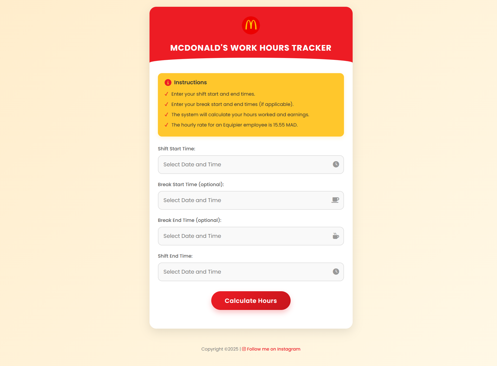

# McDonald's Work Hours Tracker

A simple web application to track work hours, calculate break times, and estimate earnings for McDonald's employees.

---

## Features

- Track your shift start and end times.
- Optionally track break times.
- Automatically calculate net hours worked and earnings.
- Works on both desktop and mobile devices.

---

## How to Use

1. Open the `index.html` file in your browser.
2. Enter your shift start and end times.
3. (Optional) Enter your break start and end times.
4. Click "Calculate Hours" to see your results.

---

## Technologies Used

- HTML
- CSS
- JavaScript
- Flatpickr (for the date and time picker)

---

## Customization

- To change the hourly rate, edit the `hourlyRate` variable in the `calculateHours` function in `index.html`.

---

## License

This project is licensed under the MIT License.

---

## Contact

For questions or feedback, feel free to reach out:

- **GitHub**: [Your GitHub Profile](https://github.com/theachraf)
- **Instagram**: [Follow me on Instagram](https://www.instagram.com/_hraaf_/)
- **Email**: achraf@gmail.com
